# Kịch bản thuyết trình: Geo-Affordance Candidate Selection (GACS)

Thời lượng gợi ý: 10-12 phút. Bản này viết theo kiểu slide: mỗi phần có sơ đồ trực quan, benchmark chính chỉ dùng **small-object cases**, còn 360-case OmniTry-Bench chỉ là phụ lục kiểm tra độ ổn định.

## 1. Mở đầu - 30 giây

**Slide:** Tên đề tài, bài toán, một hình ví dụ 4 panel.

**Lời thoại:**

> Hôm nay mình trình bày cải tiến cho OmniTry trong bài toán virtual try-on không cần mask. Trọng tâm của mình là các vật phẩm nhỏ và geometry-sensitive như nhẫn, vòng tay, khuyên tai, kính và dây chuyền. Đây là những vật phẩm mà model pretrained thường nhìn vẫn tự nhiên toàn ảnh, nhưng vật phẩm bị sai vị trí, sai scale, mờ, hoặc bị hòa vào người. Phương pháp của mình là Geo-Affordance Candidate Selection, viết tắt là GACS.

## 2. Nhắc lại lý thuyết giữa kì: vì sao cần cải tiến - 90 giây

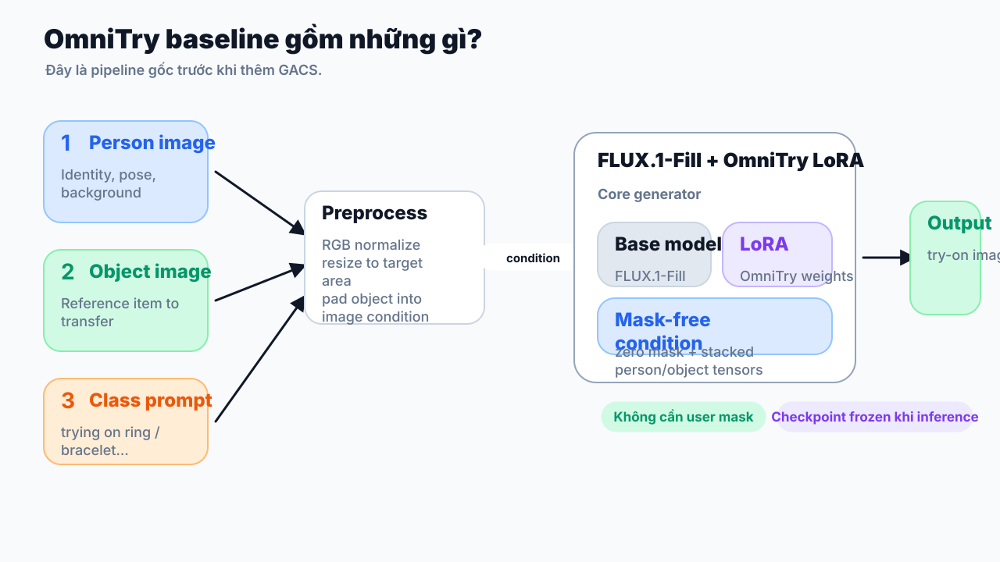

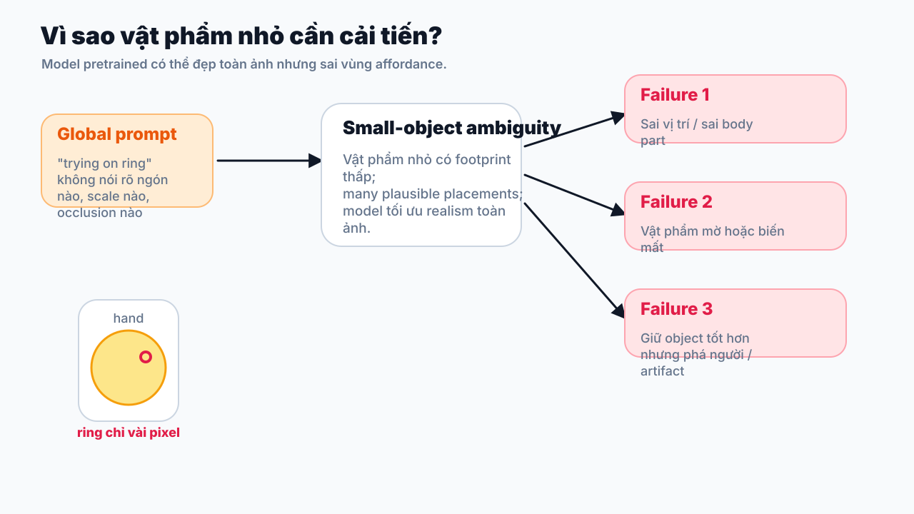

**Slide:** OmniTry / mask-free virtual try-on objective.

**Lời thoại:**

> Ở phần giữa kì, bài toán được đặt là conditional image generation: đầu vào gồm ảnh người, ảnh vật phẩm, và text prompt. Mục tiêu có hai mặt: một là transfer đúng vật phẩm vào người, hai là preserve identity, pose, background và các vùng không liên quan. OmniTry giải bài toán này theo hướng mask-free, nghĩa là không yêu cầu user cung cấp mask chính xác. Đây là lợi thế lớn về usability.

> Nhưng chính vì mask-free, bài toán trở nên under-constrained. Với áo hoặc váy, vùng cần chỉnh khá lớn và model dễ suy ra vị trí. Với vật phẩm nhỏ, tín hiệu pixel rất nhỏ: nhẫn chỉ vài pixel quanh ngón tay, khuyên tai bị tóc che, dây chuyền sát cổ áo. Prompt kiểu “trying on ring” không đủ để nói rõ ring nằm ở ngón nào, scale bao nhiêu, occlusion thế nào. Vì vậy model có thể tối ưu realism toàn ảnh nhưng bỏ lỡ chi tiết vật phẩm.

**Ý chính cần chốt:**

- Small objects có pixel footprint nhỏ nên object signal yếu.
- Geometry/affordance quan trọng hơn global appearance.
- Không có paired data sạch nên fine-tuning chưa phải hướng claim mạnh.
- Cần một cải tiến inference-time: rẻ hơn, dễ reproduce hơn, và tác động trực tiếp vào ambiguity.

## 3. Phương pháp end-to-end khi tích hợp GACS - 2 phút

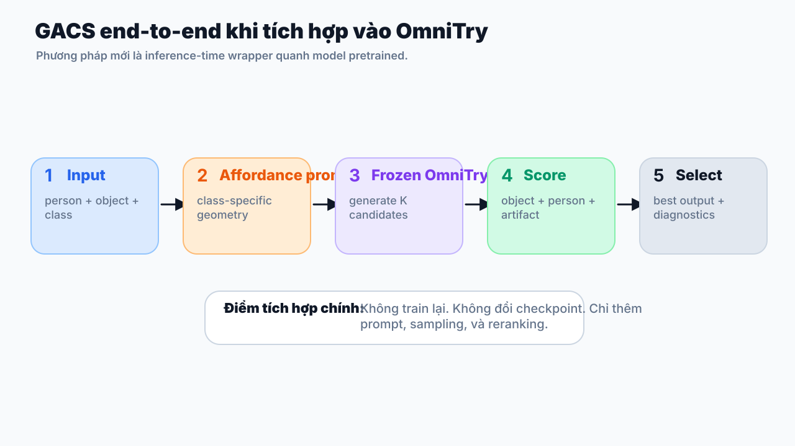

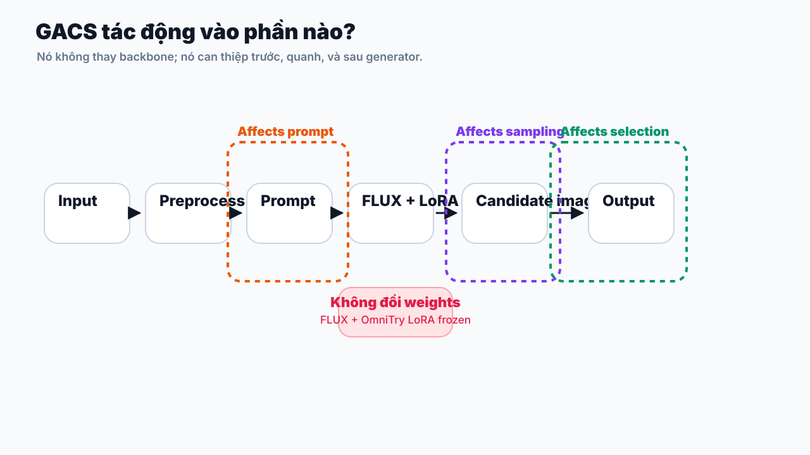

**Slide:** Pipeline tích hợp end-to-end.

**Lời thoại:**

> Khi tích hợp GACS, pipeline end-to-end vẫn bắt đầu giống OmniTry: nhận ảnh người, ảnh vật phẩm, và object class. Sau đó hệ thống chuẩn hóa ảnh sang RGB, resize theo giới hạn diện tích, và dựng conditioning cho FLUX.1-Fill + OmniTry LoRA. Điểm khác là trước khi generate, mình build prompt có affordance theo class.

> Ví dụ với ring, prompt thêm rằng ring phải nằm trên visible finger, đúng tiny scale, giữ metallic detail và finger occlusion. Với bracelet, prompt nhấn quanh wrist. Với glasses, prompt nhấn eyes và nose bridge. Sau đó model pretrained sinh K candidates với các seed khác nhau. Với mỗi candidate, GACS tính điểm object consistency trong affordance region, person preservation ngoài affordance region, và artifact health. Candidate có weighted score cao nhất được chọn làm output cuối cùng, đồng thời lưu diagnostics để giải thích vì sao nó được chọn.

**Pipeline ngắn gọn:**

```text
person image + object image + object class
-> normalize/resize inputs
-> build base OmniTry conditioning
-> add class-specific affordance prompt
-> generate K candidates with frozen pretrained model
-> score each candidate: object + person + artifact
-> select best candidate + save diagnostics
```

Proxy score:

```text
0.35 * object_consistency + 0.35 * person_preservation + 0.30 * artifact_health
```

## 4. Cải tiến ảnh hưởng như thế nào - 2 phút

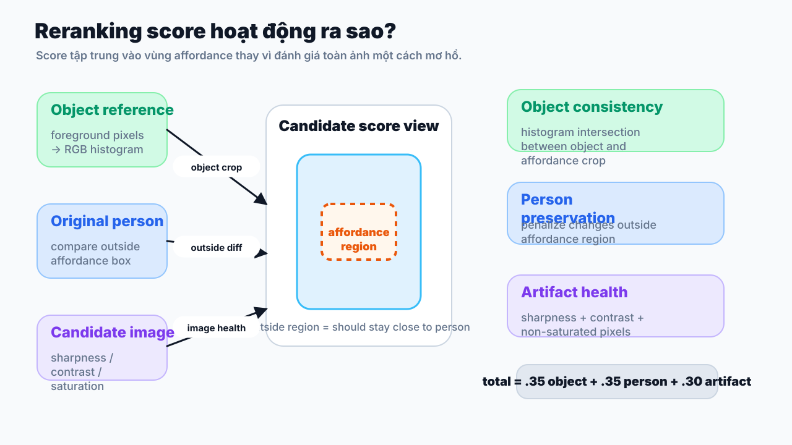

**Slide:** Ba thành phần của GACS và tác động.

**Lời thoại:**

> Thành phần thứ nhất là affordance prompt. Nó tác động trước generation, bằng cách thu hẹp không gian nghiệm: model không chỉ biết “đeo ring”, mà biết ring phải ở vùng finger, scale nhỏ, có occlusion với tay. Thành phần này giảm lỗi sai vị trí.

> Thành phần thứ hai là multi-candidate generation. Diffusion model có tính stochastic: cùng input nhưng seed khác nhau có thể cho placement khác nhau. Thay vì tin vào một sample, GACS lấy nhiều candidate để có cơ hội tìm sample tốt hơn.

> Thành phần thứ ba là reranking. Đây là phần biến trực giác thành quyết định có thể reproduce. Object score kiểm tra tín hiệu vật phẩm trong vùng affordance. Person score phạt việc làm thay đổi quá nhiều vùng ngoài affordance. Artifact score tránh candidate bị blur, saturation hoặc texture xấu. Vì vậy GACS không chỉ hỏi “ảnh nào giống vật phẩm hơn”, mà hỏi “ảnh nào vừa đặt vật phẩm đúng, vừa giữ người ổn, vừa ít artifact”.

## 5. Benchmark chính: small-object-only - 90 giây

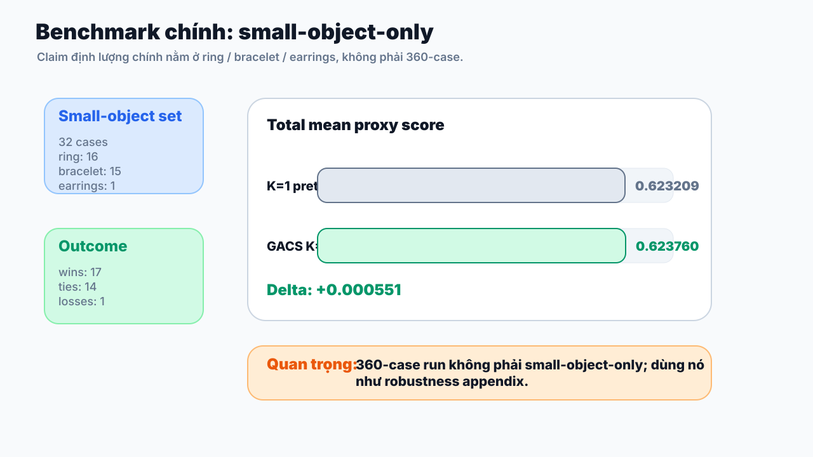

**Slide:** Small-object benchmark table. Không dùng 360 làm claim chính.

**Lời thoại:**

> Benchmark chính của mình chỉ lấy small-object hard set gồm ring, bracelet và earrings, tổng cộng 32 cases. Đây là tập phù hợp nhất với lý do mình đề xuất GACS: vật phẩm nhỏ, vùng affordance hẹp, dễ sai placement. Trên tập này, cùng pretrained checkpoint với K=1 đạt total mean 0.623209. Khi bật GACS full với K=2, điểm tăng lên 0.623760, tức delta +0.000551. GACS thắng 17 cases, hòa 14 cases, và thua 1 case.

| Protocol | Items | Total | Object | Person | Artifact |
|---|---:|---:|---:|---:|---:|
| Pretrained checkpoint, K=1 | 32 | 0.623209 | 0.255470 | 0.976477 | 0.640091 |
| Pretrained checkpoint + GACS, K=2 | 32 | 0.623760 | 0.255866 | 0.977028 | 0.640823 |
| Delta | 32 | +0.000551 | +0.000396 | +0.000551 | +0.000732 |

**Class breakdown:**

| Class | Count | K=1 total | GACS K=2 total | Delta |
|---|---:|---:|---:|---:|
| ring | 16 | 0.602326 | 0.603051 | +0.000725 |
| bracelet | 15 | 0.651278 | 0.651681 | +0.000403 |
| earrings | 1 | 0.536287 | 0.536287 | +0.000000 |

**Clarification khi bị hỏi về 360-case:**

> 360-case run không phải small-object-only; nó có cả clothing như top clothes, bottom clothes, dress và các vật phẩm lớn hơn như bag, shoe, hat. Vì vậy mình không dùng nó làm claim chính. Nó chỉ là robustness appendix để cho thấy phương pháp không collapse khi chạy rộng hơn.

## 6. 10 visual cases nên trình bày - 3 phút

Với mỗi case, trình bày theo đúng thứ tự 4 ảnh: **person**, **object**, **pretrained/K=1**, **pretrained + GACS/K=2**. Nói ngắn: affordance ở đâu, lỗi pretrained dễ mắc là gì, và GACS chọn output tốt hơn ở điểm nào.

### Case 01: `ring_woman_011_203` (ring, diverse small-object visual check)

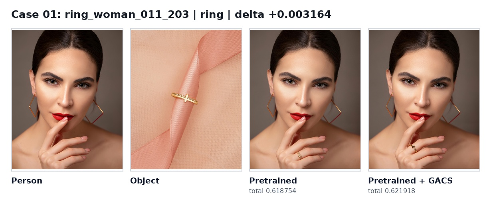

- Pretrained/K=1 total: `0.618754`
- Pretrained + GACS/K=2 total: `0.621918`
- Delta: `+0.003164`
- Object caption: Gold cross ring with small diamonds, elegant design.

**Lời thoại ngắn:**

> Ở nhóm ring, vật phẩm chỉ chiếm một vùng rất nhỏ quanh ngón tay. Điểm cần nhìn là nhẫn có nằm đúng vùng tay không, có giữ được chi tiết kim loại/shape không, và bàn tay có bị phá không. Khi nhìn 4 panel, mình muốn khán giả tập trung vào vùng affordance thay vì toàn ảnh. Điểm quan trọng là GACS chọn candidate cân bằng hơn giữa đúng vật phẩm, đúng vị trí và giữ nguyên người. Delta của case này là +0.003164.

### Case 02: `earrings_woman_004_103` (earrings, diverse small-object visual check)

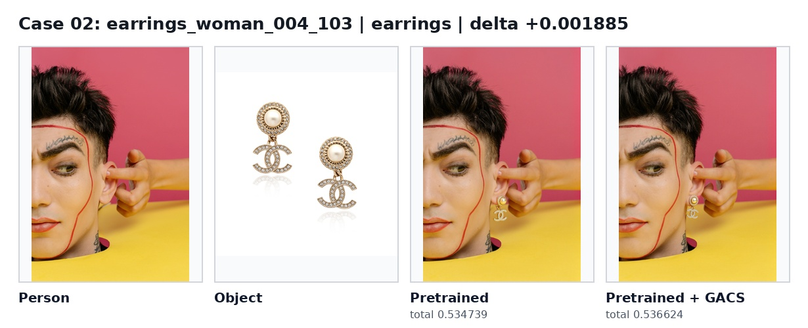

- Pretrained/K=1 total: `0.534739`
- Pretrained + GACS/K=2 total: `0.536624`
- Delta: `+0.001885`
- Object caption: Pearl and crystal CC logo drop earrings.

**Lời thoại ngắn:**

> Earrings là ví dụ cực nhỏ: vật phẩm gần tai, tóc và mặt. Mục tiêu là thay đổi cục bộ quanh tai mà không làm khuôn mặt trôi đi. Khi nhìn 4 panel, mình muốn khán giả tập trung vào vùng affordance thay vì toàn ảnh. Điểm quan trọng là GACS chọn candidate cân bằng hơn giữa đúng vật phẩm, đúng vị trí và giữ nguyên người. Delta của case này là +0.001885.

### Case 03: `glasses_woman_010_301` (glasses, diverse small-object visual check)

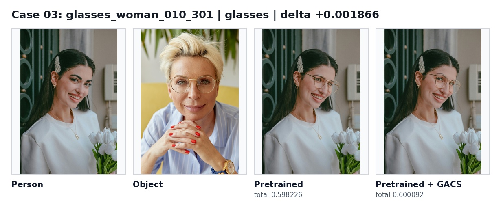

- Pretrained/K=1 total: `0.598226`
- Pretrained + GACS/K=2 total: `0.600092`
- Delta: `+0.001866`
- Object caption: Gold-rimmed, round glasses with thin metal frames.

**Lời thoại ngắn:**

> Glasses có affordance rất rõ: phải nằm qua vùng mắt và sống mũi. Đây là case dễ giải thích vì geometry constraint trực quan. Khi nhìn 4 panel, mình muốn khán giả tập trung vào vùng affordance thay vì toàn ảnh. Điểm quan trọng là GACS chọn candidate cân bằng hơn giữa đúng vật phẩm, đúng vị trí và giữ nguyên người. Delta của case này là +0.001866.

### Case 04: `necklace_woman_012_101` (necklace, diverse small-object visual check)

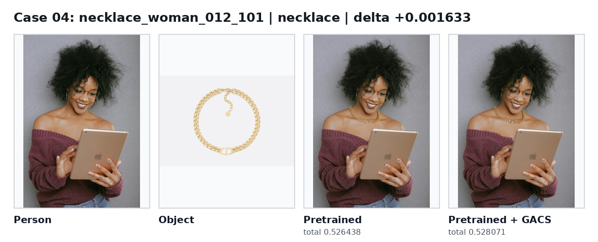

- Pretrained/K=1 total: `0.526438`
- Pretrained + GACS/K=2 total: `0.528071`
- Delta: `+0.001633`
- Object caption: Gold chain necklace with "CD" logo and small tag.

**Lời thoại ngắn:**

> Necklace nằm quanh cổ và sát đường cổ áo, dễ bị hòa vào texture trang phục. GACS giúp thu hẹp vùng tìm kiếm quanh cổ/ngực trên. Khi nhìn 4 panel, mình muốn khán giả tập trung vào vùng affordance thay vì toàn ảnh. Điểm quan trọng là GACS chọn candidate cân bằng hơn giữa đúng vật phẩm, đúng vị trí và giữ nguyên người. Delta của case này là +0.001633.

### Case 05: `bracelet_woman_008_102` (bracelet, diverse small-object visual check)

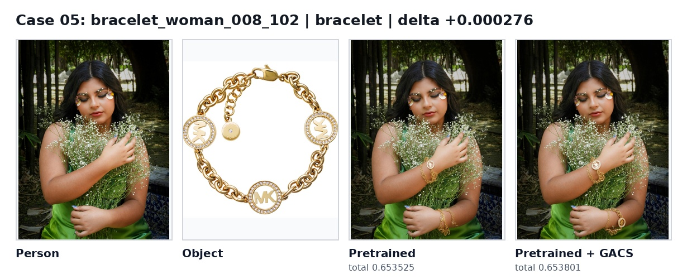

- Pretrained/K=1 total: `0.653525`
- Pretrained + GACS/K=2 total: `0.653801`
- Delta: `+0.000276`
- Object caption: Gold chain bracelet with MK logo and crystal accents.

**Lời thoại ngắn:**

> Ở nhóm bracelet, vùng cổ tay dễ bị che bởi tay, hoa, hoặc nếp áo. Điểm cần nhìn là vòng có quấn đúng quanh cổ tay không và phần ngoài cổ tay có được giữ ổn định không. Khi nhìn 4 panel, mình muốn khán giả tập trung vào vùng affordance thay vì toàn ảnh. Điểm quan trọng là GACS chọn candidate cân bằng hơn giữa đúng vật phẩm, đúng vị trí và giữ nguyên người. Delta của case này là +0.000276.

### Case 06: `ring_woman_015_204` (ring, hard small-object benchmark win)

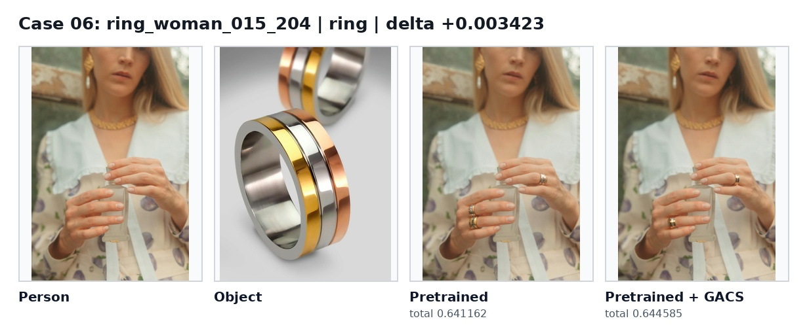

- Pretrained/K=1 total: `0.641162`
- Pretrained + GACS/K=2 total: `0.644585`
- Delta: `+0.003423`
- Object caption: Triple-layered gold, silver, and rose gold band.

**Lời thoại ngắn:**

> Ở nhóm ring, vật phẩm chỉ chiếm một vùng rất nhỏ quanh ngón tay. Điểm cần nhìn là nhẫn có nằm đúng vùng tay không, có giữ được chi tiết kim loại/shape không, và bàn tay có bị phá không. Khi nhìn 4 panel, mình muốn khán giả tập trung vào vùng affordance thay vì toàn ảnh. Điểm quan trọng là GACS chọn candidate cân bằng hơn giữa đúng vật phẩm, đúng vị trí và giữ nguyên người. Delta của case này là +0.003423.

### Case 07: `bracelet_woman_008_302` (bracelet, hard small-object benchmark win)

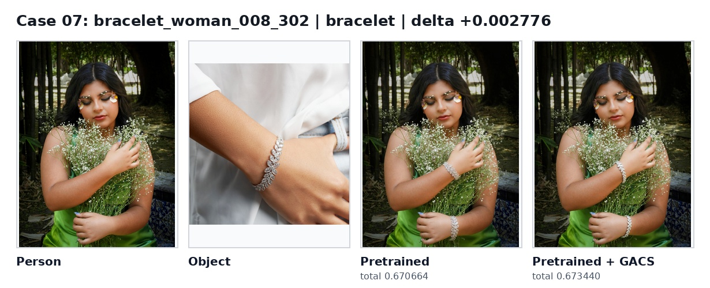

- Pretrained/K=1 total: `0.670664`
- Pretrained + GACS/K=2 total: `0.673440`
- Delta: `+0.002776`
- Object caption: Elegant leaf-shaped diamond bracelet on wrist.

**Lời thoại ngắn:**

> Ở nhóm bracelet, vùng cổ tay dễ bị che bởi tay, hoa, hoặc nếp áo. Điểm cần nhìn là vòng có quấn đúng quanh cổ tay không và phần ngoài cổ tay có được giữ ổn định không. Khi nhìn 4 panel, mình muốn khán giả tập trung vào vùng affordance thay vì toàn ảnh. Điểm quan trọng là GACS chọn candidate cân bằng hơn giữa đúng vật phẩm, đúng vị trí và giữ nguyên người. Delta của case này là +0.002776.

### Case 08: `ring_woman_015_102` (ring, hard small-object benchmark win)

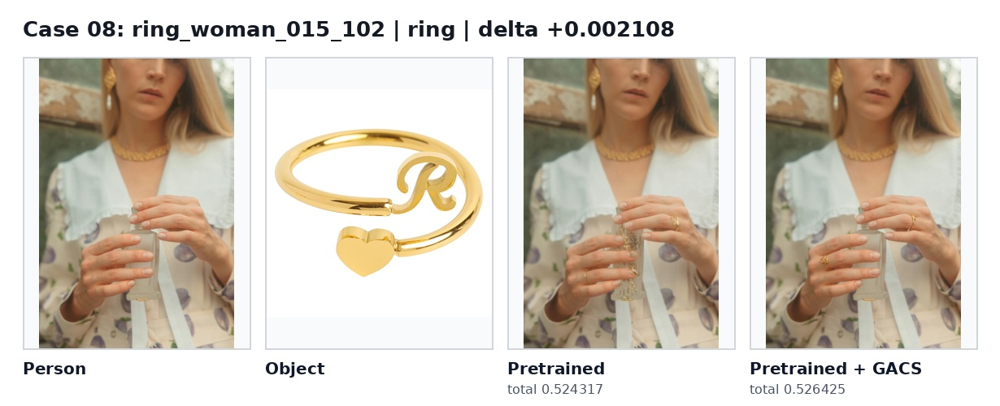

- Pretrained/K=1 total: `0.524317`
- Pretrained + GACS/K=2 total: `0.526425`
- Delta: `+0.002108`
- Object caption: Gold ring with "R" and heart-shaped charm.

**Lời thoại ngắn:**

> Ở nhóm ring, vật phẩm chỉ chiếm một vùng rất nhỏ quanh ngón tay. Điểm cần nhìn là nhẫn có nằm đúng vùng tay không, có giữ được chi tiết kim loại/shape không, và bàn tay có bị phá không. Khi nhìn 4 panel, mình muốn khán giả tập trung vào vùng affordance thay vì toàn ảnh. Điểm quan trọng là GACS chọn candidate cân bằng hơn giữa đúng vật phẩm, đúng vị trí và giữ nguyên người. Delta của case này là +0.002108.

### Case 09: `ring_woman_015_201` (ring, hard small-object benchmark win)

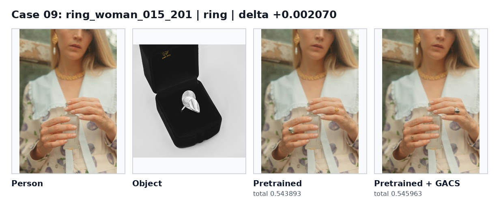

- Pretrained/K=1 total: `0.543893`
- Pretrained + GACS/K=2 total: `0.545963`
- Delta: `+0.002070`
- Object caption: Silver leaf-shaped ring with textured surface, displayed in black velvet box.

**Lời thoại ngắn:**

> Ở nhóm ring, vật phẩm chỉ chiếm một vùng rất nhỏ quanh ngón tay. Điểm cần nhìn là nhẫn có nằm đúng vùng tay không, có giữ được chi tiết kim loại/shape không, và bàn tay có bị phá không. Khi nhìn 4 panel, mình muốn khán giả tập trung vào vùng affordance thay vì toàn ảnh. Điểm quan trọng là GACS chọn candidate cân bằng hơn giữa đúng vật phẩm, đúng vị trí và giữ nguyên người. Delta của case này là +0.002070.

### Case 10: `bracelet_woman_008_103` (bracelet, hard small-object benchmark win)

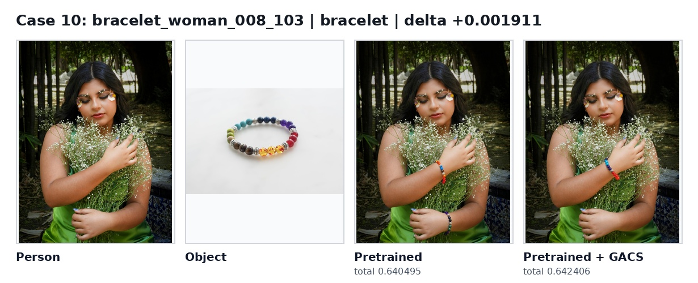

- Pretrained/K=1 total: `0.640495`
- Pretrained + GACS/K=2 total: `0.642406`
- Delta: `+0.001911`
- Object caption: Colorful beaded bracelet with silver accents, seven chakra design.

**Lời thoại ngắn:**

> Ở nhóm bracelet, vùng cổ tay dễ bị che bởi tay, hoa, hoặc nếp áo. Điểm cần nhìn là vòng có quấn đúng quanh cổ tay không và phần ngoài cổ tay có được giữ ổn định không. Khi nhìn 4 panel, mình muốn khán giả tập trung vào vùng affordance thay vì toàn ảnh. Điểm quan trọng là GACS chọn candidate cân bằng hơn giữa đúng vật phẩm, đúng vị trí và giữ nguyên người. Delta của case này là +0.001911.

## 7. Vì sao fine-tuning chưa phải main claim - 60 giây

**Lời thoại:**

> Fine-tuning không sai về mặt hướng nghiên cứu, nhưng hiện tại chưa phải câu chuyện mạnh nhất. Supervised try-on cần paired data rất khó: ảnh người chưa đeo vật phẩm, ảnh vật phẩm, và ảnh cùng người đã đeo đúng vật phẩm đó. Crawl web và pseudo-pair không đủ sạch, mask cho vật nhỏ cũng rất brittle. Trong thử nghiệm hiện tại, raw fine-tuned LoRA còn thấp hơn pretrained baseline. Vì vậy đóng góp chính nên là GACS: inference-time, training-free, chạy ngay trên pretrained checkpoint, và đánh trực tiếp vào lỗi geometry của small objects.

## 8. Hạn chế và hướng tiếp theo - 60 giây

**Lời thoại:**

> GACS không thay đổi trọng số model nên gain không thể quá lớn. Nó chọn sample tốt hơn từ cùng generator. Proxy score giúp rerank nhưng chưa thay human study. Vật thể mỏng, bóng, bị che bởi tóc hoặc tay vẫn khó. Hướng tiếp theo là dùng hand/pose keypoints để có affordance box chính xác hơn, dùng SAM hoặc GroundingDINO mask tốt hơn cho metric, và làm human preference study trên small-object categories.

## 9. Kết luận - 30 giây

**Lời thoại:**

> Kết luận là: với small-object virtual try-on, vấn đề chính là ambiguity về geometry và affordance. GACS giải quyết đúng điểm đó bằng một pipeline end-to-end đơn giản: prompt theo affordance, sinh nhiều candidate, chấm điểm cục bộ, rồi chọn output tốt nhất. Đây là cải tiến thực dụng, không cần train lại, có benchmark small-object riêng, và có các case visual để giải thích rõ tác động.

## Appendix: 10 case asset paths

| # | Case | Category | Person | Object | Pretrained/K=1 | Pretrained + GACS/K=2 | Composite |
|---:|---|---|---|---|---|---|---|
| 1 | `ring_woman_011_203` | ring | `outputs/demo/geo_method_report/assets/ring_woman_011_203/person.jpg` | `outputs/demo/geo_method_report/assets/ring_woman_011_203/object.jpg` | `outputs/demo/geo_method_report/assets/ring_woman_011_203/pretrained.jpg` | `outputs/demo/geo_method_report/assets/ring_woman_011_203/pretrained_geo.jpg` | `outputs/demo/geo_method_report/presentation/case_01_ring_woman_011_203.jpg` |
| 2 | `earrings_woman_004_103` | earrings | `outputs/demo/geo_method_report/assets/earrings_woman_004_103/person.jpg` | `outputs/demo/geo_method_report/assets/earrings_woman_004_103/object.jpg` | `outputs/demo/geo_method_report/assets/earrings_woman_004_103/pretrained.jpg` | `outputs/demo/geo_method_report/assets/earrings_woman_004_103/pretrained_geo.jpg` | `outputs/demo/geo_method_report/presentation/case_02_earrings_woman_004_103.jpg` |
| 3 | `glasses_woman_010_301` | glasses | `outputs/demo/geo_method_report/assets/glasses_woman_010_301/person.jpg` | `outputs/demo/geo_method_report/assets/glasses_woman_010_301/object.jpg` | `outputs/demo/geo_method_report/assets/glasses_woman_010_301/pretrained.jpg` | `outputs/demo/geo_method_report/assets/glasses_woman_010_301/pretrained_geo.jpg` | `outputs/demo/geo_method_report/presentation/case_03_glasses_woman_010_301.jpg` |
| 4 | `necklace_woman_012_101` | necklace | `outputs/demo/geo_method_report/assets/necklace_woman_012_101/person.jpg` | `outputs/demo/geo_method_report/assets/necklace_woman_012_101/object.jpg` | `outputs/demo/geo_method_report/assets/necklace_woman_012_101/pretrained.jpg` | `outputs/demo/geo_method_report/assets/necklace_woman_012_101/pretrained_geo.jpg` | `outputs/demo/geo_method_report/presentation/case_04_necklace_woman_012_101.jpg` |
| 5 | `bracelet_woman_008_102` | bracelet | `outputs/demo/geo_method_report/assets/bracelet_woman_008_102/person.jpg` | `outputs/demo/geo_method_report/assets/bracelet_woman_008_102/object.jpg` | `outputs/demo/geo_method_report/assets/bracelet_woman_008_102/pretrained.jpg` | `outputs/demo/geo_method_report/assets/bracelet_woman_008_102/pretrained_geo.jpg` | `outputs/demo/geo_method_report/presentation/case_05_bracelet_woman_008_102.jpg` |
| 6 | `ring_woman_015_204` | ring | `outputs/demo/geo_method_report/assets/ring_woman_015_204/person.jpg` | `outputs/demo/geo_method_report/assets/ring_woman_015_204/object.jpg` | `outputs/demo/geo_method_report/assets/ring_woman_015_204/pretrained.jpg` | `outputs/demo/geo_method_report/assets/ring_woman_015_204/pretrained_geo.jpg` | `outputs/demo/geo_method_report/presentation/case_06_ring_woman_015_204.jpg` |
| 7 | `bracelet_woman_008_302` | bracelet | `outputs/demo/geo_method_report/assets/bracelet_woman_008_302/person.jpg` | `outputs/demo/geo_method_report/assets/bracelet_woman_008_302/object.jpg` | `outputs/demo/geo_method_report/assets/bracelet_woman_008_302/pretrained.jpg` | `outputs/demo/geo_method_report/assets/bracelet_woman_008_302/pretrained_geo.jpg` | `outputs/demo/geo_method_report/presentation/case_07_bracelet_woman_008_302.jpg` |
| 8 | `ring_woman_015_102` | ring | `outputs/demo/geo_method_report/assets/ring_woman_015_102/person.jpg` | `outputs/demo/geo_method_report/assets/ring_woman_015_102/object.jpg` | `outputs/demo/geo_method_report/assets/ring_woman_015_102/pretrained.jpg` | `outputs/demo/geo_method_report/assets/ring_woman_015_102/pretrained_geo.jpg` | `outputs/demo/geo_method_report/presentation/case_08_ring_woman_015_102.jpg` |
| 9 | `ring_woman_015_201` | ring | `outputs/demo/geo_method_report/assets/ring_woman_015_201/person.jpg` | `outputs/demo/geo_method_report/assets/ring_woman_015_201/object.jpg` | `outputs/demo/geo_method_report/assets/ring_woman_015_201/pretrained.jpg` | `outputs/demo/geo_method_report/assets/ring_woman_015_201/pretrained_geo.jpg` | `outputs/demo/geo_method_report/presentation/case_09_ring_woman_015_201.jpg` |
| 10 | `bracelet_woman_008_103` | bracelet | `outputs/demo/geo_method_report/assets/bracelet_woman_008_103/person.jpg` | `outputs/demo/geo_method_report/assets/bracelet_woman_008_103/object.jpg` | `outputs/demo/geo_method_report/assets/bracelet_woman_008_103/pretrained.jpg` | `outputs/demo/geo_method_report/assets/bracelet_woman_008_103/pretrained_geo.jpg` | `outputs/demo/geo_method_report/presentation/case_10_bracelet_woman_008_103.jpg` |
